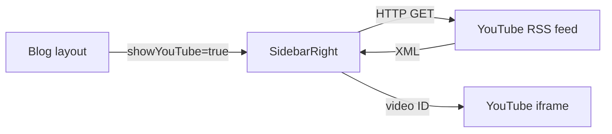
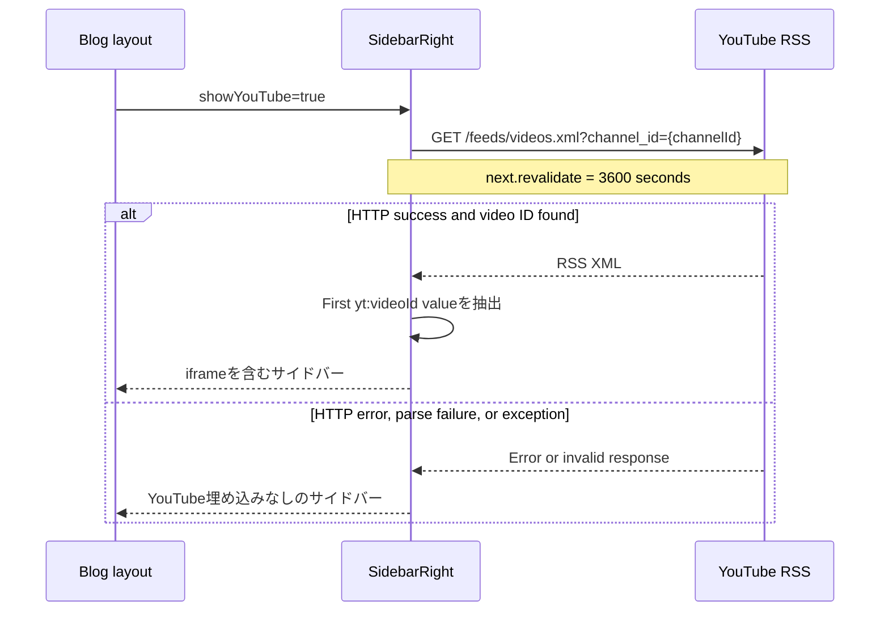

# YouTube 最新動画サイドバー設計

## 1. 概要

ブログ画面の右サイドバーに、指定した YouTube チャンネルの最新動画を埋め込んで表示する。

YouTube Data API は使用せず、公開 RSS フィードから最新動画の ID を取得する。API キーを管理せずに実装でき、YouTube へのリクエストは Next.js の `fetch` キャッシュによって最大 1 時間に 1 回の再検証に抑える。

## 2. 対象範囲

### 対象

- 日本語および英語のブログレイアウト
- 右サイドバーの YouTube 埋め込み
- RSS フィードからの最新動画 ID 取得
- 取得失敗時の表示制御

### 対象外

- YouTube チャンネルや動画の管理
- 動画一覧、ページネーション、検索
- 再生状況や視聴履歴の保存
- YouTube Data API の利用

## 3. 関連ファイル

| ファイル | 役割 |
| --- | --- |
| `src/components/ui/sidebarRight.tsx` | RSS 取得、動画 ID 抽出、埋め込みの描画 |
| `src/app/ja/blogs/layout.tsx` | 日本語ブログで YouTube 表示を有効化 |
| `src/app/en/blogs/layout.tsx` | 英語ブログで YouTube 表示を有効化 |
| `src/app/styles/sidebar.css` | 埋め込み領域のサイズと外観 |

## 4. コンポーネント構成



`SidebarRight` は Server Component として非同期に実行される。`showYouTube` が `false` の場合は RSS を取得せず、YouTube 関連要素も描画しない。

## 5. 入出力

### Props

| 名前 | 型 | 既定値 | YouTube 表示への影響 |
| --- | --- | --- | --- |
| `locale` | `"ja" \| "en"` | なし | YouTube ロジックには使用しない |
| `showToc` | `boolean` | `false` | YouTube ロジックには使用しない |
| `showYouTube` | `boolean` | `false` | `true` の場合のみ最新動画を取得する |

### 固定値

| 名前 | 用途 |
| --- | --- |
| `YOUTUBE_CHANNEL_ID` | RSS フィードの対象チャンネルID |

## 6. 処理フロー



処理の詳細は次のとおり。

1. `showYouTube` が `false` の場合、動画 ID を `null` とし、外部通信を行わない。
2. `showYouTube` が `true` の場合、対象チャンネルの RSS フィードを取得する。
3. `fetch` に `next: { revalidate: 3600 }` を指定し、レスポンスを 3,600 秒単位で再検証する。
4. HTTP ステータスが成功でなければ `null` を返す。
5. RSS の XML 文字列から、正規表現で最初の `<yt:videoId>` の値を抽出する。
6. 動画 ID を取得できた場合のみ YouTube の `iframe` を描画する。
7. 通信例外を含むエラーはコンポーネント内で吸収し、ページ全体の描画を継続する。

## 7. 描画仕様

動画 ID が取得できた場合、以下の URL を `iframe` の `src` に設定する。

```text
https://www.youtube.com/embed/{videoId}?feature=oembed
```

埋め込みには次の属性を指定する。

| 属性 | 目的 |
| --- | --- |
| `loading="lazy"` | ビューポート外にある iframe の読み込みを遅延する |
| `allowFullScreen` | 全画面再生を許可する |
| `referrerPolicy="strict-origin-when-cross-origin"` | クロスオリジン送信時の Referer 情報を制限する |
| `allow` | 再生に必要なブラウザー機能を許可する |

表示領域は幅 100%、アスペクト比 16:9、角丸 8px とする。

## 8. キャッシュと更新タイミング

- RSS の取得結果は Next.js の拡張 `fetch` によりキャッシュされる。
- `revalidate: 3600` のため、キャッシュは 1 時間を目安に再検証される。
- 新しい動画の公開直後でも、表示の切り替わりには最大で再検証間隔相当の遅延が発生し得る。
- キャッシュの具体的な永続範囲は、デプロイ先における Next.js の Data Cache 実装に依存する。

## 9. 障害時の挙動

次のいずれかが発生した場合、動画 ID は `null` となり、YouTube 埋め込みを表示しない。

- YouTube RSS への接続失敗またはタイムアウト
- HTTP 4xx / 5xx レスポンス
- RSS に `<yt:videoId>` が存在しない
- RSS の形式変更により正規表現が一致しない
- その他の実行時例外

会員操作など右サイドバーの他要素と、ブログ本文の表示は継続する。現行実装ではエラー表示、再試行 UI、ログ出力は行わない。

## 10. セキュリティとプライバシー

- RSS 取得はサーバー側で実行し、チャンネル ID 以外のユーザー情報を YouTube に送信しない。
- `iframe` が描画されたページでは、ブラウザーから `youtube.com` への通信が発生する。
- 埋め込み先は固定の HTTPS オリジンとし、RSS から取得した値は URL の動画 ID 部分にのみ使用する。
- Content Security Policy を導入または変更する場合は、`frame-src` で YouTube 埋め込み先を許可する必要がある。

## 11. テスト方針

### 単体テスト

- RSS に動画 ID がある場合、最初の ID を返すこと
- HTTP エラーの場合、`null` を返すこと
- 不正な RSS または動画 ID がない RSS の場合、`null` を返すこと
- `fetch` が例外を送出した場合、`null` を返すこと
- `showYouTube=false` の場合、`fetch` を呼び出さないこと

### コンポーネントテスト

- 動画 ID がある場合のみ `iframe` を描画すること
- `iframe` の URL、遅延読み込み、権限、Referrer Policy が仕様どおりであること
- 動画 ID がない場合もサイドバーの他要素を描画すること

### 手動確認

- 日本語・英語ブログの右サイドバーで同じ最新動画が表示されること
- 16:9 の表示比率が維持されること
- YouTube 取得失敗時もブログを閲覧できること

## 12. 既知の制約と今後の検討事項

1. XML を正規表現で解析しているため、RSS のタグ構造や名前空間表現が変わると取得できない可能性がある。堅牢性が必要な場合は XML パーサーへの置き換えを検討する。
2. エラーを記録していないため、RSS 障害と形式変更を運用上区別できない。監視が必要な場合は、個人情報を含まないサーバーログまたはメトリクスを追加する。
3. `youtube.com` の通常埋め込みを使用している。プライバシー要件に応じて `youtube-nocookie.com` の利用を検討する。
4. チャンネル ID と再検証間隔はコード内の固定値である。運用中に変更する必要がある場合は環境変数または設定ファイルへの移動を検討する。
